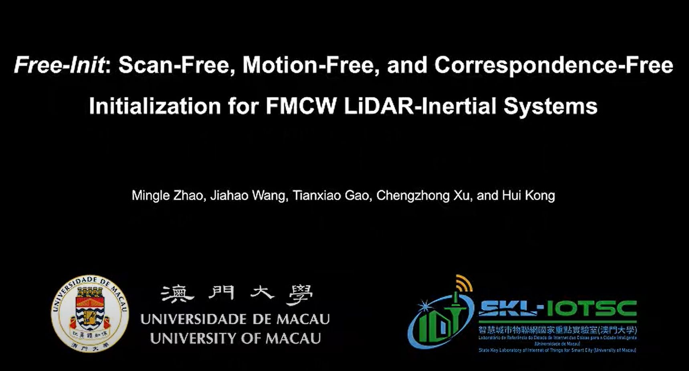

# FreeIni
This is the code repository for the IEEE-RAL'24 paper "Free-Init: Scan-Free, Motion-Free, and Correspondence-Free Initialization for FMCW LiDAR-Inertial Systems, IEEE Robotics and Automation Letters (RA-L),"

# Reference
Mingle Zhao, Jiahao Wang, Tianxiao Gao, Chengzhong Xu, and Hui Kong,  Free-Init: Scan-Free, Motion-Free, and Correspondence-Free Initialization for FMCW LiDAR-Inertial Systems, IEEE Robotics and Automation Letters (RA-L), 2024
