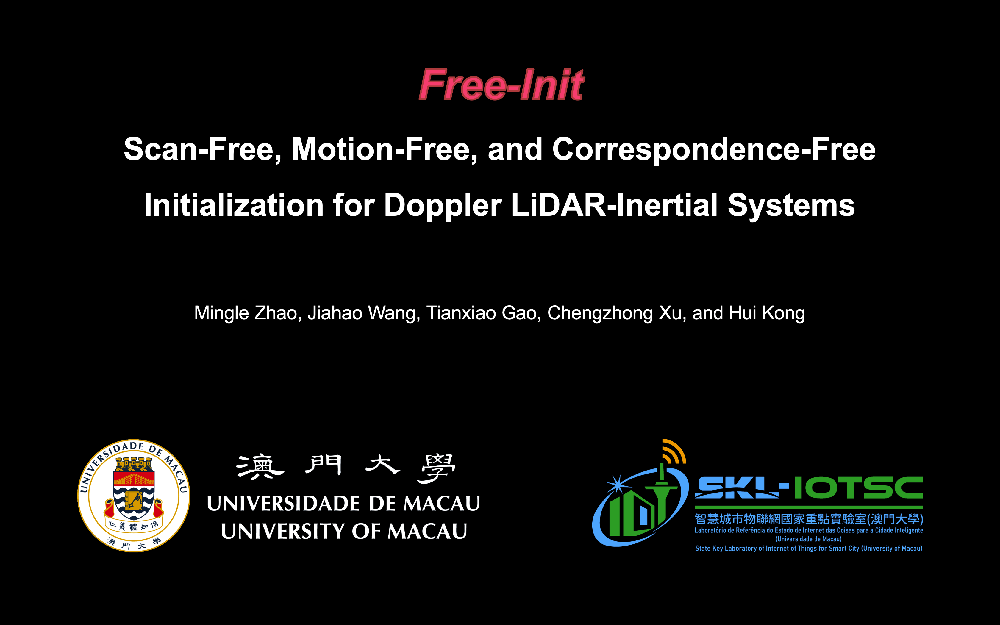

# FreeIni
This is the code repository for the IEEE RA-L'24 paper "Free-Init: Scan-Free, Motion-Free, and Correspondence-Free Initialization for Doppler LiDAR-Inertial Systems, IEEE Robotics and Automation Letters (RA-L),"

[](https://youtu.be/FbyzvJ-4bHI "Free-Init: Scan-Free, Motion-Free, and Correspondence-Free Initialization for Doppler LiDAR-Inertial Systems")

# Reference
Zhao, Mingle, Jiahao Wang, Tianxiao Gao, Chengzhong Xu, and Hui Kong. "Free-Init: Scan-Free, Motion-Free, and Correspondence-Free Initialization for Doppler LiDAR-Inertial Systems." IEEE Robotics and Automation Letters (2024). 

```
@article{zhao2024free,
  title={Free-Init: Scan-Free, Motion-Free, and Correspondence-Free Initialization for Doppler LiDAR-Inertial Systems},
  author={Zhao, Mingle and Wang, Jiahao and Gao, Tianxiao and Xu, Chengzhong and Kong, Hui},
  journal={IEEE Robotics and Automation Letters},
  year={2024},
  publisher={IEEE}
}
```
