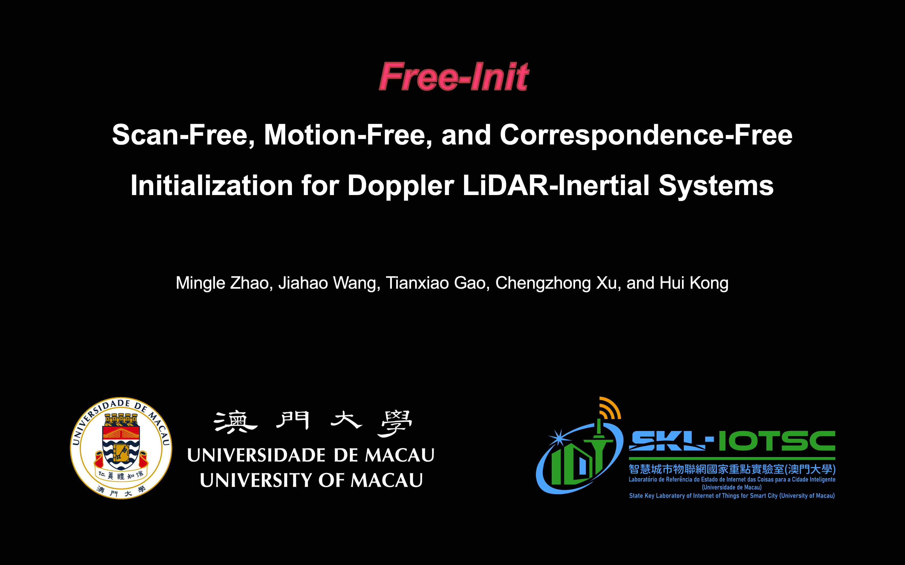
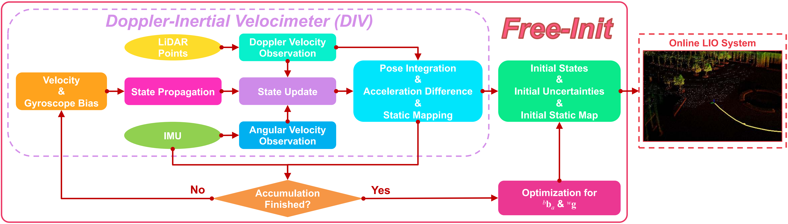
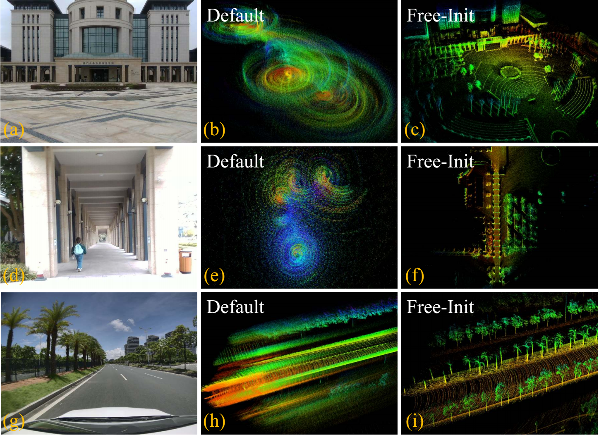
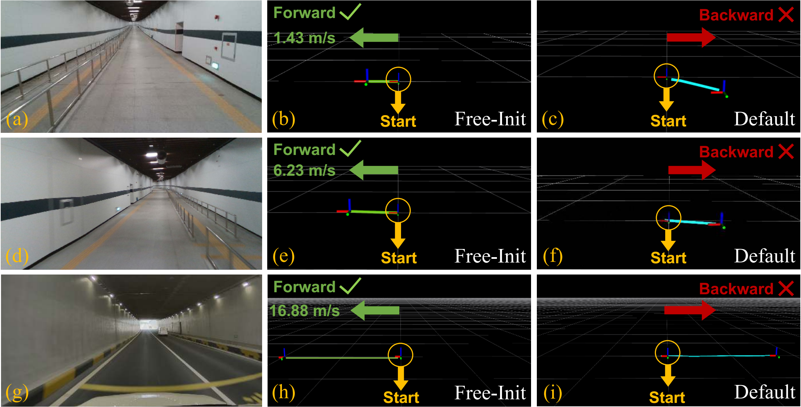
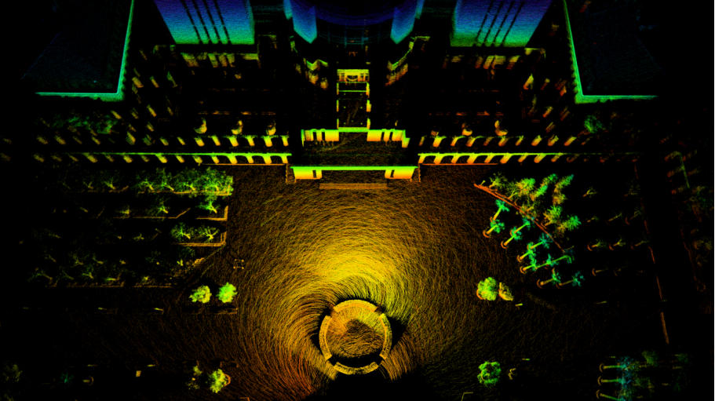
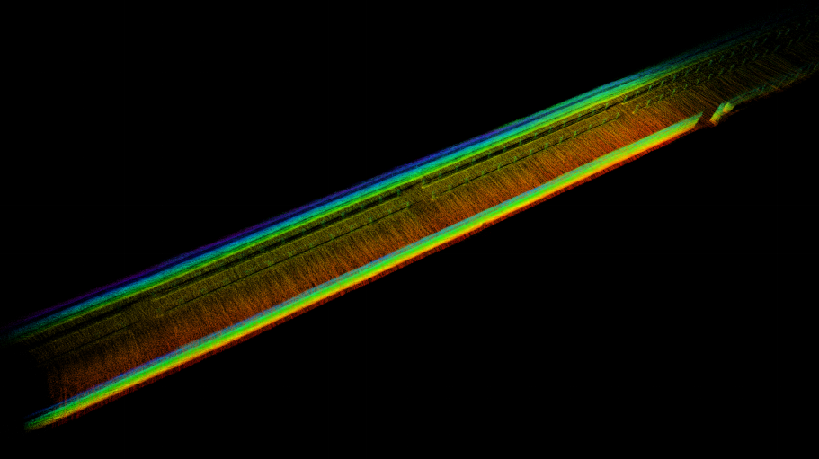
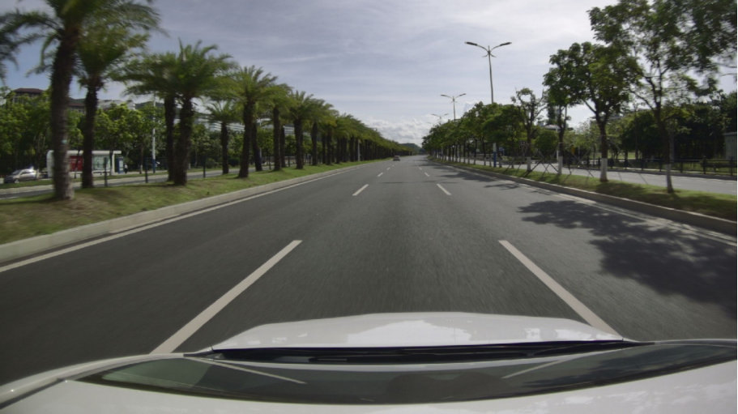
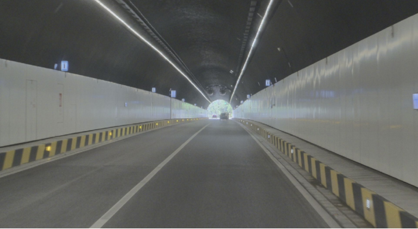

<div align="center">

# $\color{#FF577E}{𝙁𝙧𝙚𝙚\text{-}𝙄𝙣𝙞𝙩}$<br>Scan-Free, Motion-Free, and Correspondence-Free Initialization for Doppler LiDAR-Inertial Systems

<a href="https://ieeexplore.ieee.org/document/10740796/"></a>
<a href="https://arxiv.org/"></a>
<a href="https://youtu.be/FbyzvJ-4bHI"></a>
<a href="https://huggingface.co/datasets/zha0ming1e/Free-Init_Dataset"></a>
<a href="https://drive.google.com/drive/folders/1Zz6WypdraCUC_jD9iLy6nJtJanlxbCz8?usp=sharing"></a>

[](https://youtu.be/FbyzvJ-4bHI "Free-Init: Scan-Free, Motion-Free, and Correspondence-Free Initialization for Doppler LiDAR-Inertial Systems")

</div>

<p align="center">
  
  
</p>

## 1. Introduction
$\color{#FF577E}{𝙁𝙧𝙚𝙚\text{-}𝙄𝙣𝙞𝙩}$ is an initialization framework for 4D Doppler LiDAR-inertial systems that eliminates the need for LiDAR scan motion compensation (undistortion), excitation motions, and feature or map correspondences by fusing point-wise Doppler velocity measurements with inertial data under non-inertial kinematics. $\color{#FF577E}{𝙁𝙧𝙚𝙚\text{-}𝙄𝙣𝙞𝙩}$ is also plug-and-play compatible with typical LiDAR-inertial systems, and can handle initialization both in arbitrary environments, including structure-degenerated scenes, and under a wide range of initial motions, from stationary to dynamic and even aggressive. The proposed Doppler-Inertial Velocimeter (DIV) enables fast convergence and high-rate estimation, delivering estimator outputs over 10 kHz.
<p align="center">
  
</p>

$\color{#FF577E}{𝙁𝙧𝙚𝙚\text{-}𝙄𝙣𝙞𝙩}$ provides accurate initial-state estimation in both structured and structure-degenerated environments, as its intrinsic correspondence-free nature do not depend on environmental structures. The following results demonstrate the initialization performance of $\color{#FF577E}{𝙁𝙧𝙚𝙚\text{-}𝙄𝙣𝙞𝙩}$ in structured and structure-degenerated scenes.
<p align="center">
  
</p>
<p align="center">
  
</p>

### Framework Highlights

- 🚀 **Scan-Free**: Point-wise scheme. No requirement of motion compensation (undistortion) of LiDAR scans.
- 🧭 **Motion-Free**: No requirement of excitation motions or specific motion assumptions.
- 🔗 **Correspondence-Free**: No requirement of feature or map correspondence.
- ⚡ **High-Rate**: The Doppler-Inertial Velocimeter (DIV) outputs estimation results over 10 kHz.
- 🔌 **Plug-and-Play**: Easily integrated with typical LiDAR-inertial systems.

## 2. Source Code of $\color{#FF577E}{𝙁𝙧𝙚𝙚\text{-}𝙄𝙣𝙞𝙩}$
$\color{#FF577E}{𝙁𝙧𝙚𝙚\text{-}𝙄𝙣𝙞𝙩}$ is seamlessly integrated into the $\color{#F1261D}{𝗙}\color{#FF9200}{𝗠}\color{#FDDB2A}{𝗖}\color{#4DE42B}{𝗪}\color{#0FF692}{\text{-}}\color{#0BD8F9}{𝗟}\color{#2C22FB}{𝗜}\color{#C32DF3}{𝗢}$ ([**DOI**](https://doi.org/10.1109/LRA.2024.3396636) | [**Project Page**](https://github.com/IMRL/FMCW-LIO)) framework. Please refer to the initialization module of $\color{#F1261D}{𝗙}\color{#FF9200}{𝗠}\color{#FDDB2A}{𝗖}\color{#4DE42B}{𝗪}\color{#0FF692}{\text{-}}\color{#0BD8F9}{𝗟}\color{#2C22FB}{𝗜}\color{#C32DF3}{𝗢}$ ([**DOI**](https://doi.org/10.1109/LRA.2024.3396636) | [**Project Page**](https://github.com/IMRL/FMCW-LIO)) for the source code of $\color{#FF577E}{𝙁𝙧𝙚𝙚\text{-}𝙄𝙣𝙞𝙩}$.

## 3. Free-Init Dataset
The dataset for qualitative test of dynamic initialization ([**Free-Init Dataset**](https://github.com/IMRL/Free-Init)) is available on [**Hugging Face**](https://huggingface.co/datasets/zha0ming1e/Free-Init_Dataset) and [**Google Drive**](https://drive.google.com/drive/folders/1Zz6WypdraCUC_jD9iLy6nJtJanlxbCz8?usp=sharing). The characteristics of each sequence are summarized in the following table.
<table align="center">
  <thead>
    <tr>
      <th align="center" width="265">Sequence</th>
      <th align="center" width="255">Preview</th>
      <th align="center" width="255">FMCW-LIO Map</th>
      <th align="center" width="105">Platform</th>
      <th align="center" width="105">Distance (m)</th>
      <th align="center" width="105">Duration (s)</th>
    </tr>
  </thead>
  <tbody>
    <tr>
      <td align="center"><a href="https://drive.google.com/file/d/1qGwYWjciOjKOWP5qljyBob4qxZgNAQaW/view?usp=sharing">Free-Init_handheld_campus</a></td>
      <td align="center"></td>
      <td align="center"></td>
      <td align="center">Handheld</td>
      <td align="center">30</td>
      <td align="center">30</td>
    </tr>
    <tr>
      <td align="center"><a href="https://drive.google.com/file/d/1mJqSy6lXiAAaM95J3aTHiJExJB3TpXvx/view?usp=sharing">Free-Init_handheld_tunnel</a></td>
      <td align="center"></td>
      <td align="center"></td>
      <td align="center">Handheld</td>
      <td align="center">50</td>
      <td align="center">30</td>
    </tr>
    <tr>
      <td align="center"><a href="https://drive.google.com/file/d/16aO7L1RkD3v6VKc2d9YhbWm8SscLxyiu/view?usp=sharing">Free-Init_vehicular_highway</a></td>
      <td align="center"></td>
      <td align="center"></td>
      <td align="center">Vehicular</td>
      <td align="center">553</td>
      <td align="center">30</td>
    </tr>
    <tr>
      <td align="center"><a href="https://drive.google.com/file/d/1QecLekhBZgKQf2SrHZ1knZC0XzZdObBY/view?usp=sharing">Free-Init_vehicular_tunnel</a></td>
      <td align="center"></td>
      <td align="center"></td>
      <td align="center">Vehicular</td>
      <td align="center">562</td>
      <td align="center">30</td>
    </tr>
  </tbody>
</table>

## 4. Citation
If you find our algorithms, datasets, or frameworks helpful in your research, please consider citing our works.
```bibtex
@article{zhao2024free-init,
  title={Free-Init: Scan-Free, Motion-Free, and Correspondence-Free Initialization for Doppler LiDAR-Inertial Systems},
  author={Zhao, Mingle and Wang, Jiahao and Gao, Tianxiao and Xu, Chengzhong and Kong, Hui},
  journal={IEEE Robotics and Automation Letters},
  volume={9},
  number={12},
  pages={11329--11336},
  year={2024},
  publisher={IEEE}
}
```
```bibtex
@article{zhao2024fmcw-lio,
  title={FMCW-LIO: A Doppler LiDAR-Inertial Odometry},
  author={Zhao, Mingle and Wang, Jiahao and Gao, Tianxiao and Xu, Chengzhong and Kong, Hui},
  journal={IEEE Robotics and Automation Letters},
  volume={9},
  number={6},
  pages={5727--5734},
  year={2024},
  publisher={IEEE}
}
```
